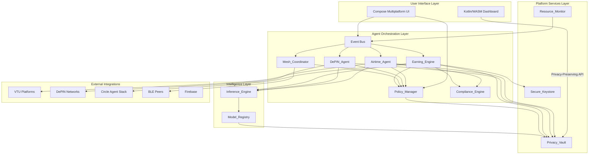
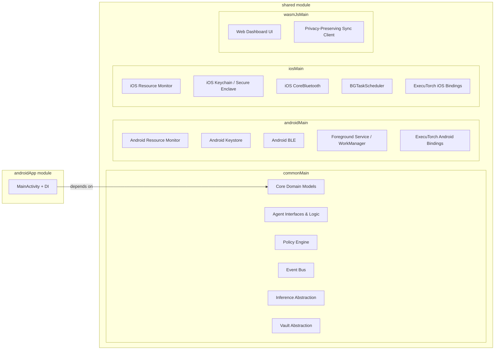
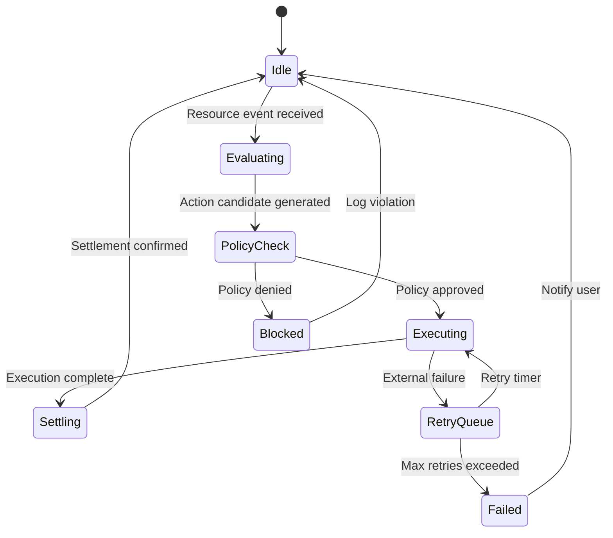

# Technical Design Document: IdleHarvest

## Overview

IdleHarvest is a privacy-first, on-device agentic system for monetizing idle phone resources in emerging markets. The system runs on Arm-powered phones using lightweight AI agents that autonomously detect, optimize, and monetize unused airtime, data bundles, bandwidth, storage, and compute resources. Users earn USDC/tokens via programmable payment rails while all reasoning and raw data stays on-device.

The architecture follows a modular agent-based design built on Kotlin Multiplatform (KMP), enabling code sharing across Android, iOS, and Web (Kotlin/WASM) targets. The shared module contains all agent logic, data models, and business rules in `commonMain`, with platform-specific implementations in `androidMain`, `iosMain`, and a future `wasmJsMain` source set.

### Key Design Decisions

1. **Agent-per-concern architecture**: Each monetization strategy (airtime, DePIN, mesh) runs as an independent agent with its own lifecycle, enabling isolated testing and graceful degradation.
2. **Event-driven coordination**: Agents communicate through a central event bus rather than direct calls, enabling loose coupling and easier testing.
3. **Policy-first execution**: All agent actions pass through the Policy_Manager before execution, ensuring user guardrails are never bypassed.
4. **Privacy-by-architecture**: No raw data leaves the device. The Privacy_Vault encrypts at rest, and any external communication uses anonymized/proof-based data only.
5. **ExecuTorch for inference**: On-device ML via ExecuTorch with Arm-optimized backends (KleidiAI/XNNPACK/SME2) keeps predictions fast and private.
6. **Hardware-backed security**: Wallet keys never leave the secure hardware (Android Keystore / iOS Secure Enclave).

## Architecture

### High-Level System Architecture



### Module Architecture (KMP)



### Agent Lifecycle



## Components and Interfaces

### 1. Resource_Monitor

Responsible for detecting and tracking idle device resources.

```kotlin
// commonMain - Interface
interface ResourceMonitor {
    val resourceProfile: StateFlow<ResourceProfile>
    fun startMonitoring(config: MonitorConfig)
    fun stopMonitoring()
    fun forceRefresh(): ResourceProfile
    fun adaptToThermalState(state: ThermalState)
}

data class MonitorConfig(
    val scanIntervalMs: Long = 900_000L, // 15 minutes
    val lowBatteryThreshold: Int = 20,
    val thermalThrottleEnabled: Boolean = true
)

enum class ThermalState { COOL, WARM, HOT, CRITICAL }

// androidMain - Implementation
class AndroidResourceMonitor(
    private val context: Context,
    private val batteryManager: BatteryManager,
    private val connectivityManager: ConnectivityManager,
    private val storageStatsManager: StorageStatsManager
) : ResourceMonitor {
    // Uses foreground service notification for persistent background execution
    // Adapts scan interval when in Doze mode via AlarmManager.setAndAllowWhileIdle
}
```

### 2. Airtime_Agent

Predicts airtime/data usage patterns and automates monetization.

```kotlin
interface AirtimeAgent {
    val state: StateFlow<AgentState>
    suspend fun evaluateBundle(bundle: AirtimeBundle): MonetizationRecommendation
    suspend fun executeAction(action: MonetizationAction): TransactionResult
    fun getTransactionHistory(): Flow<List<AirtimeTransaction>>
}

sealed class MonetizationRecommendation {
    data class Sell(val amount: Long, val platform: VtuPlatform, val confidence: Float) : MonetizationRecommendation()
    data class Transfer(val recipient: String, val amount: Long) : MonetizationRecommendation()
    data object Hold : MonetizationRecommendation()
}

interface VtuPlatformClient {
    suspend fun sell(request: SellRequest): Result<SellResponse>
    suspend fun transfer(request: TransferRequest): Result<TransferResponse>
    suspend fun checkBalance(): Result<BalanceResponse>
}
```

### 3. DePIN_Agent

Manages opt-in resource sharing to decentralized networks.

```kotlin
interface DePinAgent {
    val state: StateFlow<AgentState>
    val contributions: StateFlow<List<DePinContribution>>
    suspend fun register(network: DePinNetwork, resourceType: ResourceType)
    suspend fun unregister(network: DePinNetwork)
    suspend fun adjustContribution(threshold: ResourceThreshold)
    fun generateProof(session: ContributionSession): CryptographicProof
}

data class ResourceThreshold(
    val bandwidthMinMbps: Float = 1.0f,
    val storageMinMb: Long = 500L,
    val computeMaxCpuPercent: Int = 30
)

data class CryptographicProof(
    val sessionId: String,
    val proofData: ByteArray,
    val signature: ByteArray,
    val timestamp: Long
)
```

### 4. Mesh_Coordinator

BLE peer discovery and coordination for pooled resources.

```kotlin
interface MeshCoordinator {
    val activePeers: StateFlow<List<Peer>>
    val meshState: StateFlow<MeshState>
    fun startDiscovery()
    fun stopDiscovery()
    suspend fun connectToPeer(peerId: PeerId): Result<PeerConnection>
    fun disconnectPeer(peerId: PeerId)
    fun broadcastResourceProfile(profile: ResourceProfile)
}

data class Peer(
    val id: PeerId,
    val displayName: String,
    val resourceProfile: ResourceProfile,
    val signalStrength: Int,
    val connectionState: PeerConnectionState,
    val lastSeen: Long
)

enum class MeshState { IDLE, SCANNING, CONNECTED, ERROR }

// Max 5 simultaneous GATT connections
const val MAX_GATT_CONNECTIONS = 5
```

### 5. Earning_Engine

Manages autonomous payments and USDC settlement.

```kotlin
interface EarningEngine {
    val pendingPayouts: StateFlow<List<PayoutRequest>>
    val earningHistory: StateFlow<List<EarningEvent>>
    suspend fun initiatePayout(event: EarningEvent): Result<PayoutReceipt>
    suspend fun processNanopayment(payment: NanopaymentRequest): Result<NanopaymentReceipt>
    fun getTotalEarnings(): EarningsSummary
}

data class PayoutRequest(
    val id: String,
    val earningEventId: String,
    val amountUsdc: BigDecimal,
    val destination: WalletAddress,
    val status: PayoutStatus,
    val requiresBiometric: Boolean
)

enum class PayoutStatus { PENDING, POLICY_CHECK, SIGNING, SUBMITTED, CONFIRMED, FAILED }
```

### 6. Policy_Manager

User-defined guardrails for agent autonomy.

```kotlin
interface PolicyManager {
    val activePolicies: StateFlow<List<Policy>>
    fun setPolicy(policy: Policy)
    fun removePolicy(policyId: String)
    suspend fun checkAction(agentId: AgentId, action: AgentAction): PolicyDecision
    fun getDefaults(): List<Policy>
}

data class Policy(
    val id: String,
    val agentId: AgentId,
    val autonomyLevel: AutonomyLevel,
    val maxTransactionPerDay: BigDecimal?,
    val maxTransactionSingle: BigDecimal?,
    val resourceShareLimits: ResourceThreshold?,
    val requireBiometricAbove: BigDecimal?,
    val isActive: Boolean = true
)

enum class AutonomyLevel { MANUAL, SEMI_AUTOMATIC, FULLY_AUTOMATIC }

sealed class PolicyDecision {
    data object Approved : PolicyDecision()
    data class Denied(val reason: String, val violatedPolicy: Policy) : PolicyDecision()
    data class RequiresApproval(val action: AgentAction) : PolicyDecision()
}
```

### 7. Inference_Engine

On-device AI execution via ExecuTorch.

```kotlin
interface InferenceEngine {
    val loadedModel: StateFlow<ModelInfo?>
    val benchmarkResults: StateFlow<BenchmarkReport?>
    suspend fun loadModel(modelId: String): Result<ModelInfo>
    suspend fun runInference(input: InferenceInput): Result<InferenceOutput>
    suspend fun hotSwapModel(newModelId: String): Result<ModelInfo>
    suspend fun runBenchmark(config: BenchmarkConfig): BenchmarkReport
    fun selectBackend(thermalState: ThermalState): InferenceBackend
}

enum class InferenceBackend { KLEIDIAI, XNNPACK, SME2, CPU_BASELINE }

data class BenchmarkReport(
    val modelId: String,
    val backend: InferenceBackend,
    val iterationCount: Int,
    val latencyMinMs: Long,
    val latencyMaxMs: Long,
    val latencyMeanMs: Double,
    val latencyP95Ms: Long,
    val memoryUsageMb: Float,
    val powerDrawMw: Float?,
    val deviceMetadata: DeviceMetadata
)

data class DeviceMetadata(
    val socModel: String,
    val coreConfig: String,
    val ramGb: Float,
    val osVersion: String
)
```

### 8. Privacy_Vault

Encrypted on-device storage.

```kotlin
interface PrivacyVault {
    suspend fun store(key: String, data: ByteArray): Result<Unit>
    suspend fun retrieve(key: String): Result<ByteArray?>
    suspend fun delete(key: String): Result<Unit>
    suspend fun deleteAll(): Result<Unit>
    suspend fun exportAnonymized(dataType: DataType, consentToken: ConsentToken): Result<ByteArray>
    fun isIntegrityValid(): Boolean
}

// Encryption is AES-256-GCM with keys derived from device-bound secrets
// All raw resource data, transactions, model outputs, and reasoning traces stored here
```

### 9. Secure_Keystore

Hardware-backed wallet security.

```kotlin
// commonMain - expect declaration
expect class SecureKeystore {
    fun generateKeyPair(alias: String): Result<PublicKey>
    fun sign(alias: String, data: ByteArray): Result<ByteArray>
    fun requireBiometric(alias: String, challenge: ByteArray): Result<ByteArray>
    fun getPublicKey(alias: String): Result<PublicKey>
    fun isKeyInSecureHardware(alias: String): Boolean
    fun lockSigningOperations(durationMs: Long)
}

// androidMain - actual implementation using Android Keystore API
// iosMain - actual implementation using Security framework + Secure Enclave
```

### 10. Compliance_Engine

Regulatory validation for agent actions.

```kotlin
interface ComplianceEngine {
    suspend fun checkTransaction(transaction: TransactionRequest): ComplianceDecision
    suspend fun updateRules(rules: ComplianceRuleSet): Result<Unit>
    fun getCurrentRules(country: String, carrier: String): ComplianceRuleSet
    fun getAuditLog(): Flow<List<ComplianceAuditEntry>>
}

data class ComplianceRuleSet(
    val country: String,
    val carrier: String?,
    val dailyTransactionLimit: BigDecimal,
    val monthlyTransactionLimit: BigDecimal,
    val kycThreshold: BigDecimal,
    val rateLimitPerHour: Int,
    val version: Int,
    val lastUpdated: Long
)

sealed class ComplianceDecision {
    data object Approved : ComplianceDecision()
    data class Blocked(val regulation: String, val reason: String) : ComplianceDecision()
}
```

### 11. Model_Registry

Model lifecycle and update management.

```kotlin
interface ModelRegistry {
    val availableModels: StateFlow<List<ModelMetadata>>
    suspend fun downloadModel(modelId: String): Result<ModelFile>
    suspend fun verifyIntegrity(modelFile: ModelFile): Boolean
    suspend fun rollback(modelId: String): Result<ModelFile>
    fun getActiveModel(purpose: ModelPurpose): ModelMetadata?
}

data class ModelMetadata(
    val id: String,
    val version: String,
    val purpose: ModelPurpose,
    val sizeBytes: Long,
    val quantization: QuantizationLevel,
    val targetHardware: HardwareProfile,
    val sha256Checksum: String,
    val isStable: Boolean
)

enum class ModelPurpose { USAGE_PREDICTION, RESOURCE_OPTIMIZATION, PRICE_ESTIMATION }
enum class QuantizationLevel { FP32, FP16, INT8, INT4 }
```

### 12. Event Bus

Central event coordination between agents.

```kotlin
interface AgentEventBus {
    fun <T : AgentEvent> publish(event: T)
    fun <T : AgentEvent> subscribe(eventType: KClass<T>): Flow<T>
}

sealed class AgentEvent {
    data class ResourceUpdated(val profile: ResourceProfile) : AgentEvent()
    data class BundleExpiring(val bundle: AirtimeBundle, val expiryHours: Int) : AgentEvent()
    data class PeerDiscovered(val peer: Peer) : AgentEvent()
    data class EarningCompleted(val event: EarningEvent) : AgentEvent()
    data class PolicyViolation(val agentId: AgentId, val action: AgentAction) : AgentEvent()
    data class ThermalStateChanged(val state: ThermalState) : AgentEvent()
    data class ConnectivityChanged(val isOnline: Boolean) : AgentEvent()
}
```

### 13. Circuit Breaker

Resilience pattern for external service calls.

```kotlin
class CircuitBreaker(
    private val failureThreshold: Int = 5,
    private val backoffPeriodMs: Long = 60_000L
) {
    sealed class State {
        data object Closed : State()
        data class Open(val openedAt: Long, val backoffMs: Long) : State()
        data object HalfOpen : State()
    }

    val state: StateFlow<State>
    suspend fun <T> execute(block: suspend () -> T): Result<T>
    fun reset()
}
```

## Data Models

### Core Domain Models

```kotlin
// Resource Profile - snapshot of device idle resources
data class ResourceProfile(
    val airtimeBalance: AirtimeBalance?,
    val dataBundles: List<DataBundle>,
    val availableBandwidthMbps: Float,
    val freeStorageMb: Long,
    val idleComputePercent: Int,
    val batteryLevel: Int,
    val isCharging: Boolean,
    val thermalState: ThermalState,
    val timestamp: Long
)

data class AirtimeBalance(
    val carrier: String,
    val amountUnits: Long, // in smallest currency unit
    val currency: String,
    val expiryTimestamp: Long?
)

data class DataBundle(
    val carrier: String,
    val remainingMb: Long,
    val totalMb: Long,
    val expiryTimestamp: Long,
    val bundleType: String // e.g., "daily", "weekly", "monthly"
)

// Transaction models
data class AirtimeTransaction(
    val id: String,
    val type: TransactionType,
    val amount: Long,
    val currency: String,
    val counterparty: String?,
    val platform: String,
    val outcome: TransactionOutcome,
    val timestamp: Long,
    val complianceCheckId: String
)

enum class TransactionType { SELL, TRANSFER, PURCHASE }
enum class TransactionOutcome { SUCCESS, FAILED, PENDING, CANCELLED }

// DePIN contribution tracking
data class DePinContribution(
    val networkId: String,
    val networkName: String,
    val resourceType: ResourceType,
    val sessionId: String,
    val startedAt: Long,
    val endedAt: Long?,
    val earnedTokens: BigDecimal,
    val tokenSymbol: String,
    val proof: CryptographicProof?
)

enum class ResourceType { BANDWIDTH, STORAGE, COMPUTE }

// Earning models
data class EarningEvent(
    val id: String,
    val source: EarningSource,
    val amountUsdc: BigDecimal,
    val amountLocal: BigDecimal?,
    val localCurrency: String?,
    val agentId: AgentId,
    val timestamp: Long
)

enum class EarningSource { AIRTIME_SALE, DEPIN_REWARD, MESH_SERVICE, NANOPAYMENT }

data class EarningsSummary(
    val totalEarnedUsdc: BigDecimal,
    val last24hUsdc: BigDecimal,
    val last7dUsdc: BigDecimal,
    val bySource: Map<EarningSource, BigDecimal>
)

// Agent identification
@JvmInline
value class AgentId(val value: String)

@JvmInline
value class PeerId(val value: String)

@JvmInline
value class WalletAddress(val value: String)

// Agent state
enum class AgentState { IDLE, EVALUATING, EXECUTING, PAUSED, ERROR }
```

### Persistence Schema (Privacy_Vault)

Data is stored encrypted in key-value pairs within the vault. Logical groupings:

| Key Pattern | Data Type | Description |
|-------------|-----------|-------------|
| `resource_profile_latest` | ResourceProfile | Most recent scan result |
| `resource_profile_history_{date}` | List\<ResourceProfile\> | Daily history for ML training |
| `tx_airtime_{id}` | AirtimeTransaction | Individual transaction record |
| `tx_depin_{id}` | DePinContribution | DePIN contribution record |
| `tx_earning_{id}` | EarningEvent | Earning event record |
| `policy_{id}` | Policy | User policy definition |
| `compliance_rules_{country}` | ComplianceRuleSet | Compliance rules per jurisdiction |
| `compliance_audit_{date}` | List\<ComplianceAuditEntry\> | Audit trail |
| `model_metadata_{id}` | ModelMetadata | Model registry entries |
| `peer_roster` | List\<Peer\> | Known mesh peers |
| `error_log` | RollingLog(7 days) | Diagnostics data |

### Serialization

All domain models use `kotlinx.serialization` for encoding/decoding to JSON within the Privacy_Vault. This enables:
- Cross-platform consistency (same serializer in commonMain)
- Schema evolution via `@SerialName` and optional fields
- Efficient binary encoding option via CBOR for BLE mesh communication


## Correctness Properties

*A property is a characteristic or behavior that should hold true across all valid executions of a system — essentially, a formal statement about what the system should do. Properties serve as the bridge between human-readable specifications and machine-verifiable correctness guarantees.*

### Property 1: Resource Profile Completeness

*For any* device state (any combination of available/unavailable resource metrics), the Resource_Monitor SHALL produce a ResourceProfile that contains a defined value or explicit null/error marker for each of: airtime balance, data bundle status, available bandwidth, free storage, and idle compute capacity.

**Validates: Requirements 1.1, 1.3**

### Property 2: Thermal and Power State Adaptation

*For any* combination of thermal state (cool, warm, hot, critical) and power state (charging, battery level), all adaptive subsystems (Resource_Monitor scan frequency, Inference_Engine model selection, agent activity level) SHALL adjust their behavior according to the defined adaptation rules — never exceeding safe thermal thresholds and never conflicting with OS power management constraints.

**Validates: Requirements 1.5, 7.6, 10.3, 10.4, 10.6**

### Property 3: Monetization Recommendation Generation

*For any* airtime bundle with an expiry timestamp within 72 hours from now, the Airtime_Agent SHALL produce exactly one MonetizationRecommendation (sell, transfer, or hold). For any bundle with expiry beyond 72 hours, no recommendation SHALL be generated.

**Validates: Requirements 2.1**

### Property 4: Policy and Compliance Gating

*For any* agent action that involves a financial transaction or resource commitment, the Policy_Manager check and Compliance_Engine check SHALL both be invoked and approved BEFORE the action is executed. If either check denies the action, execution SHALL NOT occur and the denial SHALL be logged.

**Validates: Requirements 2.6, 5.2, 6.4, 12.2, 12.3**

### Property 5: Retry Logic Invariant

*For any* external service call failure (VTU API, DePIN network, Circle API), the retry mechanism SHALL attempt at most 3 retries with exponentially increasing backoff intervals, and SHALL notify the user on final failure. The retry count SHALL never exceed the configured maximum.

**Validates: Requirements 2.3, 17.5**

### Property 6: Privacy Vault Storage Round-Trip

*For any* valid domain object (transaction, policy, contribution record, model metadata, compliance rule), serializing and storing it in the Privacy_Vault and then retrieving and deserializing it SHALL produce an object equal to the original.

**Validates: Requirements 2.4, 3.4, 6.5, 9.1, 12.1**

### Property 7: DePIN Threshold Enforcement

*For any* resource level and user-defined sharing threshold, the DePIN_Agent SHALL contribute resources only when the available amount exceeds the threshold. When resources drop below the threshold, contributions SHALL be reduced or paused.

**Validates: Requirements 3.2, 3.3**

### Property 8: Cryptographic Proof Validity

*For any* DePIN contribution session, the generated cryptographic proof SHALL contain the session ID, contribution data, and a valid signature that can be independently verified using the device's public key.

**Validates: Requirements 3.6**

### Property 9: Peer Roster Invariant

*For any* sequence of peer connect and disconnect events, the Mesh_Coordinator active peer roster SHALL accurately reflect the current set of connected peers — containing exactly and only those peers that are actively connected, with their latest Resource_Profiles.

**Validates: Requirements 4.2, 4.4**

### Property 10: GATT Connection Capacity Invariant

*For any* sequence of peer connection requests, the number of active simultaneous GATT connections SHALL never exceed 5. Additional peers beyond this limit SHALL be discoverable via advertising rotation but not hold active connections.

**Validates: Requirements 4.3**

### Property 11: Mesh Communication Encryption

*For any* message transmitted between peers via BLE, the message payload SHALL be encrypted using AES-GCM authenticated encryption. Decryption by an authenticated peer SHALL recover the original message exactly.

**Validates: Requirements 4.5**

### Property 12: Adaptive Scan Interval

*For any* power state, the Mesh_Coordinator scan interval SHALL be aggressive (shorter interval) when the device is charging and conservative (longer interval) when on battery, maintaining the invariant that battery-mode interval > charging-mode interval.

**Validates: Requirements 4.6**

### Property 13: Idempotent Payout Guarantee

*For any* earning event, regardless of how many times payout is attempted for that event, exactly one payout SHALL be created and submitted. Duplicate payout attempts for the same earning event SHALL be rejected.

**Validates: Requirements 5.5**

### Property 14: Biometric Gating by Transaction Value

*For any* transaction amount and user-configured high-value threshold, biometric authentication SHALL be required if and only if the amount exceeds the threshold. Transactions at or below the threshold SHALL proceed without biometric challenge.

**Validates: Requirements 5.7, 13.4**

### Property 15: Policy Transaction Limit Enforcement

*For any* sequence of transactions by an agent within a time period, the cumulative transaction amount SHALL never exceed the configured per-agent per-period maximum. The transaction that would cause the limit to be exceeded SHALL be blocked.

**Validates: Requirements 6.3**

### Property 16: Policy Immediate Application

*For any* valid policy created or updated at time T, the next agent action check occurring after T SHALL evaluate against the new/updated policy. No action check after T SHALL use the stale policy version.

**Validates: Requirements 6.2**

### Property 17: Inference Fallback Guarantee

*For any* model load failure or inference execution error, the Inference_Engine SHALL produce a valid output via rule-based heuristics. The system SHALL never fail to produce a decision due to model issues.

**Validates: Requirements 7.5**

### Property 18: Vault Encryption Round-Trip

*For any* byte array stored in the Privacy_Vault, the raw persisted bytes SHALL NOT equal the original plaintext (proving encryption is applied), and decrypting the stored data SHALL recover the exact original byte array.

**Validates: Requirements 8.1**

### Property 19: Anonymization Before Transmission

*For any* data export request, the output SHALL contain no personally identifiable information (PII), and a valid consent token SHALL be required before any data leaves the device. Export without consent SHALL always fail.

**Validates: Requirements 8.3**

### Property 20: Secure Deletion Completeness

*For any* set of data stored in the Privacy_Vault, after invoking secure deletion, all subsequent retrieval attempts for any key SHALL return null/empty.

**Validates: Requirements 8.5**

### Property 21: Model Integrity Verification

*For any* model file and its declared SHA-256 checksum, the Model_Registry integrity check SHALL accept files whose computed hash matches the declared checksum and reject files whose hash does not match.

**Validates: Requirements 9.3**

### Property 22: Model Rollback Availability

*For any* model update sequence, the Model_Registry SHALL retain the previous model version as a rollback target. The previous version SHALL remain available until the new version is explicitly marked stable.

**Validates: Requirements 9.5**

### Property 23: Benchmark Statistics Correctness

*For any* array of 100 inference latency measurements, the computed benchmark statistics (min, max, mean, p95) SHALL be mathematically correct: min ≤ mean ≤ max, p95 ≥ 95th percentile value, and mean equals sum/count.

**Validates: Requirements 11.3**

### Property 24: Benchmark Report Serialization Round-Trip

*For any* valid BenchmarkReport, serializing to JSON and deserializing back SHALL produce an equivalent BenchmarkReport with all fields (including device metadata) preserved.

**Validates: Requirements 11.5**

### Property 25: Compliance Audit Completeness

*For any* compliance check (whether approved or denied), a corresponding audit entry SHALL exist containing the check result, timestamp, transaction details, and applicable regulation. No compliance check SHALL be unlogged.

**Validates: Requirements 12.4**

### Property 26: Secure Keystore Signing Correctness

*For any* signing request, the Secure_Keystore SHALL return a valid cryptographic signature that can be verified against the corresponding public key, without ever exposing the private key material.

**Validates: Requirements 13.3**

### Property 27: Biometric Lockout After Consecutive Failures

*For any* sequence of biometric authentication attempts, if 3 consecutive attempts fail, signing operations SHALL be locked for the configured cooldown period. A successful attempt at any point SHALL reset the consecutive failure counter.

**Validates: Requirements 13.5**

### Property 28: Localization Completeness

*For any* supported locale (English, French, Swahili, Hausa) and any UI string key, the localization system SHALL resolve to a non-empty translated string. No locale SHALL produce missing or empty translations for defined keys.

**Validates: Requirements 14.6, 15.3**

### Property 29: Safe Defaults on Incomplete Onboarding

*For any* partial onboarding state (any subset of steps skipped), the system SHALL apply conservative safe defaults for all skipped steps, ensuring the system operates safely even without full user configuration.

**Validates: Requirements 15.5**

### Property 30: Circuit Breaker State Machine

*For any* sequence of success and failure calls to an external service, the circuit breaker SHALL transition to OPEN state after exactly 5 consecutive failures, remain OPEN for the configured backoff period, transition to HALF_OPEN to test connectivity, and return to CLOSED on success or OPEN on another failure.

**Validates: Requirements 16.1**

### Property 31: Rolling Error Log Window

*For any* set of error log entries, the on-device log SHALL retain entries from the last 7 days and prune entries older than 7 days. No entry within the 7-day window SHALL be lost, and no entry outside it SHALL be retained.

**Validates: Requirements 16.2**

### Property 32: Offline Queue and Retry

*For any* pending transaction, proof, or submission generated while the device is offline, the item SHALL be queued and automatically retried when connectivity returns. No queued item SHALL be lost during the offline period.

**Validates: Requirements 16.3**

### Property 33: Watchdog Agent Restart

*For any* agent whose main loop is unresponsive for more than 60 seconds, the watchdog timer SHALL trigger a restart of that agent. Agents responsive within 60 seconds SHALL never be restarted by the watchdog.

**Validates: Requirements 16.5**

### Property 34: System Health Indicator Derivation

*For any* combination of agent states (idle, error, paused) and connectivity status (online, offline), the system health indicator SHALL deterministically map to the correct color: green (all agents healthy, online), yellow (some agents degraded or offline), red (critical failures or multiple agents in error state).

**Validates: Requirements 16.6**


## Error Handling

### Strategy Overview

IdleHarvest employs a layered error handling strategy optimized for intermittent connectivity and resource-constrained devices common in emerging markets.

### Error Categories

| Category | Examples | Strategy |
|----------|----------|----------|
| Transient Network | VTU API timeout, DePIN disconnect | Retry with exponential backoff (max 3 attempts) |
| Service Degradation | Circle API overloaded, DePIN node unreachable | Circuit breaker (open after 5 failures, backoff period) |
| Device Resource | Low memory, thermal throttle, low battery | Graceful degradation (reduce agent activity, smaller models) |
| Security | Tamper detection, biometric failure, key compromise | Immediate lockdown, user notification |
| Data Integrity | Corrupt model file, vault checksum mismatch | Rollback to known-good state, log and notify |
| Platform | OS kills background service, permission revoked | Reschedule via WorkManager/BGTaskScheduler |

### Circuit Breaker Implementation

Each external service integration (VTU platforms, DePIN networks, Circle API) wraps calls in a circuit breaker:

```kotlin
// Each agent has its own circuit breaker per external service
val vtuCircuitBreaker = CircuitBreaker(
    failureThreshold = 5,
    backoffPeriodMs = 60_000L // 1 minute
)

// Usage pattern
suspend fun executeVtuSale(request: SellRequest): Result<SellResponse> {
    return vtuCircuitBreaker.execute {
        vtuClient.sell(request)
    }
}
```

### Offline Queue

When the device is offline, all outbound operations are queued:

```kotlin
interface OfflineQueue {
    suspend fun enqueue(item: QueuedOperation)
    suspend fun processQueue() // Called when connectivity returns
    fun getPendingCount(): Int
    fun getOldestItemAge(): Duration
}

sealed class QueuedOperation {
    data class PendingTransaction(val request: PayoutRequest) : QueuedOperation()
    data class PendingProof(val proof: CryptographicProof) : QueuedOperation()
    data class PendingMetrics(val anonymizedData: ByteArray) : QueuedOperation()
}
```

### Watchdog Timers

Each background agent runs with a watchdog that monitors liveness:

```kotlin
class AgentWatchdog(
    private val timeoutMs: Long = 60_000L,
    private val onTimeout: suspend (AgentId) -> Unit
) {
    fun heartbeat(agentId: AgentId) // Called by agent each loop iteration
    // If no heartbeat within timeoutMs, onTimeout restarts the agent
}
```

### Error Logging

- Rolling 7-day on-device error log
- Structured entries: timestamp, agent ID, error category, message, stack trace hash
- Accessible via diagnostics screen
- Critical failures (with user consent) generate anonymized crash reports — no PII, no transaction details

### Graceful Degradation Order

When resources are constrained, the system degrades in this priority:

1. **First**: Reduce BLE scan frequency, pause DePIN contributions
2. **Second**: Switch to smaller inference models, reduce monitoring interval
3. **Third**: Pause all non-essential agents, maintain only earning queue and vault access
4. **Fourth**: Minimal mode — only foreground notification and vault integrity checks


## Testing Strategy

### Overview

Testing follows a dual approach: property-based tests for universal correctness guarantees and example-based unit/integration tests for specific scenarios and external integrations.

### Property-Based Testing

**Library**: [Kotest](https://kotest.io/) with its property testing module (`kotest-property`) — a mature Kotlin-native PBT library that supports KMP commonTest.

**Configuration**:
- Minimum 100 iterations per property test
- Each test tagged with property reference: `// Feature: idle-harvest, Property {N}: {title}`
- Custom generators for domain types (ResourceProfile, AirtimeBundle, Policy, etc.)

**Scope**: All 34 correctness properties defined above are implemented as property-based tests in `shared/src/commonTest/`. Key areas:

| Property Group | Test File | Properties Covered |
|---------------|-----------|-------------------|
| Resource Monitor | `ResourceMonitorPropertyTest.kt` | 1, 2, 12 |
| Agent Decision Logic | `AgentDecisionPropertyTest.kt` | 3, 7, 17 |
| Policy & Compliance | `PolicyCompliancePropertyTest.kt` | 4, 15, 16, 25 |
| Resilience | `ResiliencePropertyTest.kt` | 5, 30, 31, 32, 33 |
| Privacy & Security | `PrivacySecurityPropertyTest.kt` | 6, 18, 19, 20, 26, 27 |
| Payments | `PaymentPropertyTest.kt` | 13, 14 |
| Mesh Networking | `MeshPropertyTest.kt` | 9, 10, 11 |
| Inference | `InferencePropertyTest.kt` | 21, 22, 23, 24 |
| UI & Config | `UIConfigPropertyTest.kt` | 28, 29, 34 |
| DePIN | `DePinPropertyTest.kt` | 8 |

### Unit Tests (Example-Based)

Focused on specific scenarios, edge cases, and integration points:

- **Agent lifecycle**: State transitions (idle → evaluating → executing → settling)
- **VTU platform client**: Mocked API responses for success, failure, timeout
- **Circle API integration**: Mocked payout flows
- **Onboarding flow**: Screen count, skip behavior, default application
- **UI components**: Compose UI snapshot tests for dashboard, health indicator
- **Serialization**: Specific known-good JSON payloads

### Integration Tests

- **BLE**: Multi-device tests (3+ physical Arm devices) for peer discovery and communication
- **ExecuTorch**: Model loading and inference on real Arm hardware with backend benchmarking
- **Firebase**: Deployment pipeline validation (hosting deploy, app distribution upload)
- **VTU Platforms**: Simulated VTU environment for end-to-end transaction flow
- **Background Execution**: WorkManager/BGTaskScheduler scheduling verification
- **Power**: Battery drain measurement via Arm Performix tooling

### Performance Regression Tests

Run per CI build:
- Inference latency (target <100ms p95)
- Memory usage during inference
- Model size verification (<10MB)
- Cold start time (<3 seconds)

### Test Infrastructure

```
shared/
  src/
    commonTest/
      kotlin/com/maku/idleharvest/
        property/           # All property-based tests
        unit/               # Example-based unit tests
        generators/         # Custom Kotest generators for domain types
        fakes/              # Fake implementations for testing
    androidHostTest/
      kotlin/com/maku/idleharvest/
        integration/        # Android-specific integration tests
```

### Validation Pipeline Integration

All property and unit tests run as part of the pre-commit validation pipeline:
1. `./gradlew shared:allTests` — Runs commonTest (properties + units) across all targets
2. `./gradlew detekt` — Static analysis
3. `./gradlew spotlessCheck` — Formatting verification
4. `./gradlew lint` — Android lint checks

### Custom Generators (Kotest Property Testing)

```kotlin
// Example generators for domain types
val resourceProfileArb = arbitrary {
    ResourceProfile(
        airtimeBalance = Arb.orNull(airtimeBalanceArb).bind(),
        dataBundles = Arb.list(dataBundleArb, 0..5).bind(),
        availableBandwidthMbps = Arb.float(0f..100f).bind(),
        freeStorageMb = Arb.long(0L..128_000L).bind(),
        idleComputePercent = Arb.int(0..100).bind(),
        batteryLevel = Arb.int(0..100).bind(),
        isCharging = Arb.boolean().bind(),
        thermalState = Arb.enum<ThermalState>().bind(),
        timestamp = Arb.long(0L..Long.MAX_VALUE).bind()
    )
}

val policyArb = arbitrary {
    Policy(
        id = Arb.uuid().bind().toString(),
        agentId = AgentId(Arb.stringPattern("[a-z_]+").bind()),
        autonomyLevel = Arb.enum<AutonomyLevel>().bind(),
        maxTransactionPerDay = Arb.orNull(Arb.bigDecimal(0.01, 10000.0)).bind(),
        maxTransactionSingle = Arb.orNull(Arb.bigDecimal(0.01, 1000.0)).bind(),
        resourceShareLimits = Arb.orNull(resourceThresholdArb).bind(),
        requireBiometricAbove = Arb.orNull(Arb.bigDecimal(1.0, 500.0)).bind(),
        isActive = Arb.boolean().bind()
    )
}
```

